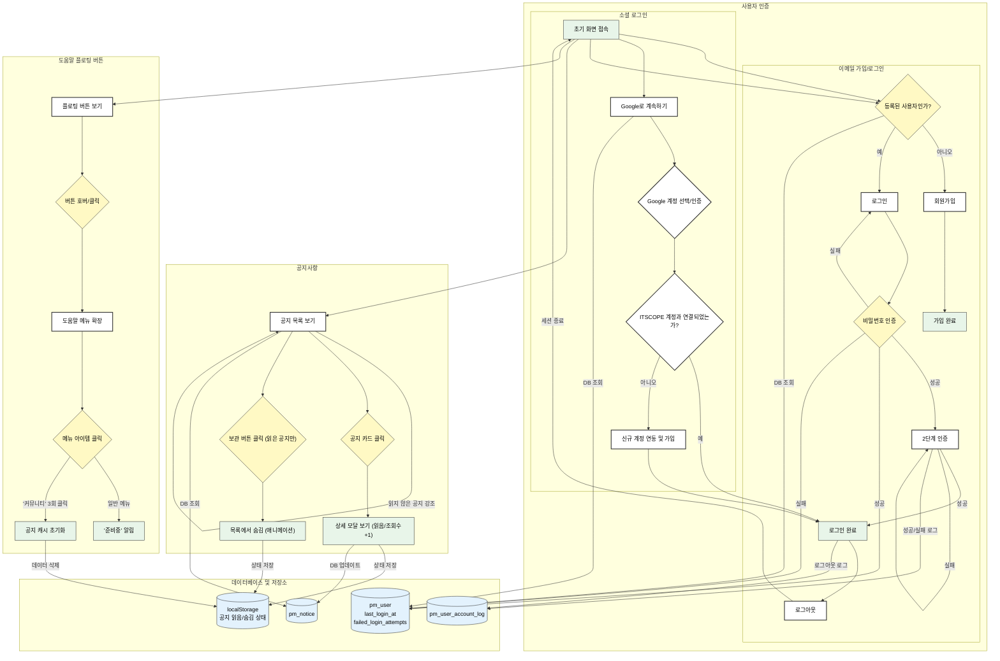

# ITSCOPE PMO 사용자 인증 및 주요 기능 흐름

이 문서는 ITSCOPE PMO 서비스의 신규 사용자 회원가입, 기존 사용자 로그인, 시스템 공지사항 확인, 도움말 기능 사용에 대한 전체적인 흐름을 설명합니다.

## 전체 기능 흐름 다이어그램

---

## 상세 시나리오

### 시나리오 1: 신규 사용자 회원가입 (이메일)

서비스에 처음 방문한 사용자가 이메일 주소를 사용하여 새로운 계정을 생성하는 과정입니다.

-   **1단계: 시작 화면 및 이메일 입력 (Welcome / Email Step)**
    1.  사용자가 서비스에 접속하면 "프로젝트 관리의 새로운 시작"이라는 문구가 포함된 `WelcomePanel`과 함께 로고가 표시됩니다.
    2.  오른쪽에는 이메일을 입력하거나 'Google로 계속하기'를 선택할 수 있는 `EmailStep` 컴포넌트가 나타납니다.
    3.  이 시나리오에서는 사용자가 자신의 이메일 주소를 입력하고 '계속' 버튼을 클릭합니다.
    4.  시스템은 입력된 이메일이 이미 등록되어 있는지 `getUserByEmail` 유틸리티 함수를 통해 확인합니다.
    5.  시스템은 등록되지 않은 신규 이메일로 판단하고, 다음 단계를 '회원가입'으로 결정합니다.

-   **2단계: 회원 정보 입력 (Signup Step)**
    1.  사용자에게 '회원가입' 화면(`SignupStep`)이 표시됩니다. 화면 좌측은 `SignUpInfoPanel`로 전환되어 회원가입 관련 정보를 안내합니다.
    2.  이전 단계에서 입력한 이메일 주소가 화면 상단에 표시됩니다.
    3.  사용자는 '이름', '비밀번호', '비밀번호 확인' 필드를 모두 입력합니다.
    4.  '이용약관' 및 '개인정보처리방침' 동의 체크박스를 선택합니다.
    5.  모든 정보가 유효하게 입력되면 '회원가입' 버튼이 활성화되고, 사용자는 이 버튼을 클릭합니다.

-   **3단계: 가입 성공 (Success Step)**
    1.  회원가입이 성공적으로 완료되면, `SuccessStep` 컴포넌트가 렌더링됩니다.
    2.  "성공적으로 가입되었습니다"와 같은 환영 메시지와 함께 사용자의 이메일 주소가 표시됩니다.
    3.  사용자는 '계속' 버튼을 클릭하여 2단계 인증 화면으로 이동합니다.

### 시나리오 2: Google 계정으로 로그인

Google 계정을 이용하여 서비스에 간편하게 로그인하거나 신규 가입하는 과정입니다.

-   **1단계: Google로 계속하기 선택**
    1.  사용자는 초기 화면(`EmailStep`)에서 'Google로 계속하기' 버튼을 클릭합니다.
    2.  브라우저에서 Google 계정 선택 및 인증 팝업이 나타납니다. 사용자는 자신의 Google 계정을 선택하고 인증을 완료합니다.

-   **2단계: 계정 연동 확인 및 처리**
    1.  시스템은 사용자의 Google 계정 이메일이 ITSCOPE 서비스에 이미 등록되어 있는지 확인합니다.
    2.  **(기존 사용자)** 이미 해당 이메일로 가입된 계정이 있다면, Google 계정과 기존 ITSCOPE 계정이 연동되며 바로 '로그인 완료' 상태가 됩니다.
    3.  **(신규 사용자)** 등록된 계정이 없다면, Google 계정 정보를 바탕으로 신규 ITSCOPE 계정이 생성 및 연동된 후 '로그인 완료' 상태가 됩니다.

-   **3단계: 로그인 성공 (Success Step)**
    1.  인증 및 계정 처리가 완료되면 `SuccessStep`으로 이동하여 로그인 성공 메시지를 확인하고 대시보드로 이동합니다.

### 시나리오 3: 기존 사용자 로그인 (이메일)

이미 계정을 가지고 있는 사용자가 이메일과 비밀번호로 서비스에 로그인하는 과정입니다.

-   **1단계: 시작 화면 및 이메일 입력 (Welcome / Email Step)**
    1.  신규 사용자 시나리오와 동일하게, 사용자는 이메일 주소를 입력하고 '계속' 버튼을 클릭합니다.
    2.  시스템은 `getUserByEmail` 함수를 통해 이메일을 확인하고, 이미 등록된 사용자임을 감지합니다.
    3.  시스템은 다음 단계를 '로그인'으로 결정합니다.

-   **2단계: 비밀번호 입력 (Signin Step)**
    1.  `SigninStep` 컴포넌트가 표시됩니다.
    2.  화면에는 사용자 프로필 이미지(있을 경우), 이름, 이메일 주소가 표시됩니다.
    3.  사용자는 자신의 비밀번호를 입력하고 '계속' 버튼을 클릭합니다. **(성공 시 `pm_user.failed_login_attempts` 초기화, 실패 시 1 증가)**
    4.  만약 비밀번호를 잊었다면, '비밀번호를 잊으셨나요?' 링크를 클릭하여 비밀번호 재설정 절차를 시작할 수 있습니다. (현재는 콘솔 로그만 출력)

-   **3단계: 2단계 인증 (Two Factor Step)**
    1.  로그인이 성공하면, 보안 강화를 위해 `TwoFactorStep` (2FA) 화면으로 이동합니다.
    2.  사용자에게 이메일 또는 SMS 등으로 전송된 인증 코드를 입력하라는 메시지가 표시됩니다.
    3.  사용자가 올바른 인증 코드를 입력하고 '계속' 버튼을 클릭합니다.

-   **4단계: 로그인 성공 (Success Step)**
    1.  2단계 인증이 완료되면 `SuccessStep` 컴포넌트가 나타납니다. 이때, `pm_user.last_login_at`이 현재 시간으로 업데이트되고, `pm_user_account_log` 테이블에 로그인 성공 로그가 기록됩니다.
    2.  "성공적으로 로그인되었습니다" 메시지와 함께 대시보드로 이동할 수 있는 '계속' 버튼이 표시됩니다. 

### 시나리오 4: 시스템 공지사항 확인 및 관리

사용자가 서비스에 접속하여 시스템의 주요 공지들을 확인하고 관리하는 과정입니다. 이 흐름은 사용자 인증 흐름과 별개로 초기 화면에서 즉시 상호작용이 가능합니다.

-   **1단계: 공지 목록 확인**
    1.  사용자가 서비스 초기 화면에 진입하면, 로그인/회원가입 영역 하단에 `NoticeList` 컴포넌트가 표시됩니다.
    2.  아직 읽지 않은 공지는 제목이 **굵은 폰트**로 표시되고, 제목 옆에는 **녹색 점 마커**가 있어 시각적으로 강조됩니다.

-   **2단계: 공지 상세 내용 확인 (읽음 처리)**
    1.  사용자가 특정 공지 카드(`NoticeCard`)를 클릭합니다.
    2.  화면 중앙에 해당 공지의 전체 내용이 담긴 상세 모달(`NoticeDetailModal`)이 나타나고, 해당 공지의 조회수가 1 증가합니다.
    3.  동시에, 클릭한 공지는 '읽음' 상태로 처리되어 목록에서 굵은 폰트와 녹색 점 마커가 사라집니다. 이 상태는 브라우저에 저장되어 다음에 방문할 때도 유지됩니다.
    4.  사용자는 모달의 '확인' 버튼을 눌러 창을 닫습니다.

-   **3단계: 공지 보관 (목록에서 숨기기)**
    1.  사용자가 **읽음 처리된** 특정 공지 카드 위에 마우스 커서를 올리면, 카드 우측에 체크 아이콘 모양의 '보관' 버튼이 나타납니다.
    2.  사용자가 이 버튼을 클릭하면, 해당 카드는 오른쪽으로 미끄러지며 사라지는 애니메이션과 함께 목록에서 숨김 처리됩니다.
    3.  이 상태 역시 브라우저에 저장되어, 이후 접속 시 보관 처리된 공지는 목록에 나타나지 않습니다.

### 시나리오 5: 도움말 기능 사용 (신규)

사용자가 서비스 이용 중 도움이 필요할 때 플로팅 버튼을 통해 관련 기능을 사용하는 과정입니다.

-   **1단계: 도움말 메뉴 확장**
    1.  사용자는 화면 좌측 하단에 항상 떠 있는 원형의 로고 버튼(`HelpFloatingButton`)을 확인합니다.
    2.  **(데스크톱)** 버튼 위에 마우스 커서를 올리거나, **(모바일)** 버튼을 터치하면, 버튼 위로 여러 도움말 메뉴가 애니메이션과 함께 나타납니다.

-   **2단계: 메뉴 기능 사용**
    1.  사용자가 확장된 메뉴(`고객센터 문의`, `자주 묻는 질문` 등) 중 하나를 클릭합니다.
    2.  현재는 개발 중인 기능이므로, "'해당 기능'은 현재 준비중입니다." 라는 안내 메시지가 화면에 잠시 나타났다가 사라집니다.

-   **3단계: 공지 상태 초기화 (숨겨진 기능)**
    1.  테스트 또는 기타 목적으로 공지사항의 '읽음'/'숨김' 상태를 초기화하고 싶을 경우, 사용자는 '커뮤니티' 메뉴를 1초 안에 빠르게 3번 클릭합니다.
    2.  클릭 조건이 충족되면 "캐시가 초기화되었습니다." 라는 메시지가 나타나고, 페이지가 자동으로 새로고침됩니다.
    3.  새로고침 후, 모든 공지사항은 다시 '안 읽음' 상태(굵은 글씨와 녹색 점)로 표시되며, 보관처리했던 공지도 다시 목록에 나타납니다. 

### 시나리오 6: 로그아웃 (신규)

로그인된 사용자가 서비스에서 로그아웃하는 과정입니다.

-   **1단계: 로그아웃 실행**
    1.  사용자는 대시보드 등 로그인 후에 접근 가능한 페이지에서 '로그아웃' 버튼을 클릭합니다.
    
-   **2단계: 로그 기록 및 세션 종료**
    1.  시스템은 `pm_user_account_log` 테이블에 'Logout' 활동 로그를 기록합니다.
    2.  사용자의 세션이 종료되고, 초기 로그인 화면으로 리디렉션됩니다. 