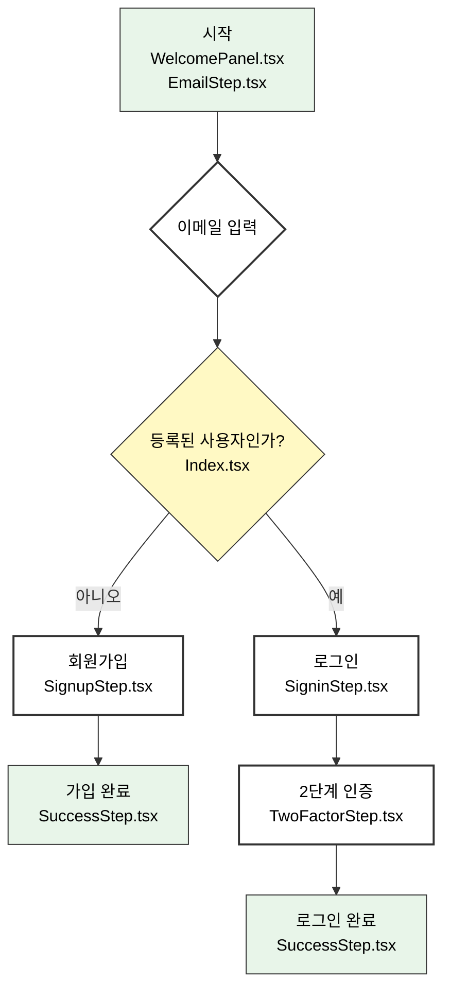

# ITSCOPE PMO 사용자 인증 흐름

이 문서는 ITSCOPE PMO 서비스의 신규 사용자 회원가입 및 기존 사용자 로그인에 대한 전체적인 흐름을 설명합니다.

## 인증 흐름 다이어그램

---

## 상세 시나리오

### 시나리오 1: 신규 사용자 회원가입

서비스에 처음 방문한 사용자가 새로운 계정을 생성하는 과정입니다.

-   **1단계: 시작 화면 및 이메일 입력 (Welcome / Email Step)**
    1.  사용자가 서비스에 접속하면 "프로젝트 관리의 새로운 시작"이라는 문구가 포함된 `WelcomePanel`과 함께 로고가 표시됩니다.
    2.  오른쪽에는 이메일을 입력하거나 'Google로 계속하기'를 선택할 수 있는 `EmailStep` 컴포넌트가 나타납니다.
    3.  사용자는 자신의 이메일 주소를 입력하고 '계속' 버튼을 클릭합니다.
    4.  시스템은 입력된 이메일이 이미 등록되어 있는지 `getUserByEmail` 유틸리티 함수를 통해 확인합니다.
    5.  이 시나리오에서는 등록되지 않은 신규 이메일이므로, 시스템은 다음 단계를 '회원가입'으로 결정합니다.

-   **2단계: 회원 정보 입력 (Signup Step)**
    1.  사용자에게 '회원가입' 화면(`SignupStep`)이 표시됩니다. 화면 좌측은 `SignUpInfoPanel`로 전환되어 회원가입 관련 정보를 안내합니다.
    2.  이전 단계에서 입력한 이메일 주소가 화면 상단에 표시됩니다.
    3.  사용자는 '이름', '비밀번호', '비밀번호 확인' 필드를 모두 입력합니다.
    4.  '이용약관' 및 '개인정보처리방침' 동의 체크박스를 선택합니다.
    5.  모든 정보가 유효하게 입력되면 '회원가입' 버튼이 활성화되고, 사용자는 이 버튼을 클릭합니다.

-   **3단계: 가입 성공 (Success Step)**
    1.  회원가입이 성공적으로 완료되면, `SuccessStep` 컴포넌트가 렌더링됩니다.
    2.  "성공적으로 가입되었습니다"와 같은 환영 메시지와 함께 사용자의 이메일 주소가 표시됩니다.
    3.  사용자는 '계속' 버튼을 클릭하여 대시보드(미구현)로 이동할 수 있습니다.

### 시나리오 2: 기존 사용자 로그인

이미 계정을 가지고 있는 사용자가 서비스에 로그인하는 과정입니다.

-   **1단계: 시작 화면 및 이메일 입력 (Welcome / Email Step)**
    1.  신규 사용자 시나리오와 동일하게, 사용자는 이메일 주소를 입력하고 '계속' 버튼을 클릭합니다.
    2.  시스템은 `getUserByEmail` 함수를 통해 이메일을 확인하고, 이미 등록된 사용자임을 감지합니다.
    3.  시스템은 다음 단계를 '로그인'으로 결정합니다.

-   **2단계: 비밀번호 입력 (Signin Step)**
    1.  `SigninStep` 컴포넌트가 표시됩니다.
    2.  화면에는 사용자 프로필 이미지(있을 경우), 이름, 이메일 주소가 표시됩니다.
    3.  사용자는 자신의 비밀번호를 입력하고 '계속' 버튼을 클릭합니다.
    4.  만약 비밀번호를 잊었다면, '비밀번호를 잊으셨나요?' 링크를 클릭하여 비밀번호 재설정 절차를 시작할 수 있습니다. (현재는 콘솔 로그만 출력)

-   **3단계: 2단계 인증 (Two Factor Step)**
    1.  로그인이 성공하면, 보안 강화를 위해 `TwoFactorStep` (2FA) 화면으로 이동합니다.
    2.  사용자에게 이메일 또는 SMS 등으로 전송된 인증 코드를 입력하라는 메시지가 표시됩니다.
    3.  사용자가 올바른 인증 코드를 입력하고 '계속' 버튼을 클릭합니다.

-   **4단계: 로그인 성공 (Success Step)**
    1.  2단계 인증이 완료되면 `SuccessStep` 컴포넌트가 나타납니다.
    2.  "성공적으로 로그인되었습니다" 메시지와 함께 대시보드로 이동할 수 있는 '계속' 버튼이 표시됩니다. 